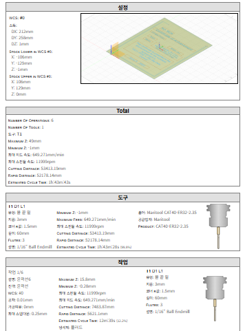

# 점진성형기술을 활용한 다양한 박판부품 개발에 대한 연구

기술 스택:  
Fusion360, G-code, 밀링NC

프로젝트 링크:  
https://github.com/seung064/certificate_project

프로젝트 시작:  
2022년 4월 4일

마감 일자:  
2022년 6월 20일

인원:  
이승민, 허일수, 강주성, 단계항

# 🎨디자인 및 실험

---

# 🧠기획

---

## <기획 의도>

**기존의 프레스 성형기술**의 종류는 많으나 각각의 **단점**도 많습니다. 가공의 공정이 많고, 대량생산이 어렵고 충격이 많이 가해지면 금형 수명이 짧아질 뿐더러 적용할 제품이 적은 단점이 있습니다.

그러나 **점진성형기술**은 **국부적으로 변형이 가능**하며 **성형이 가능**해 일반적인 프레스 성형과 비교하여 큰 장점이 있습니다. 또한 **국부적 접촉과 변형으로 인해 성형하중이 줄어**들 뿐만 아니라 **소재의 성형성도 향상**시킬 수 있고 기존 프레스 성형의 어렵고 복잡한 형상도 성형할 수 있다는 특징이 있어 연구하고자 합니다.

연구는 **알루미늄판으로 진행**되며 알루미늄은 열과 전기의 양도체이며 강인하면서도 연성과 전성이 있어 얇은 박이나 선을 만들기 쉬워 Text 또는 Logo를 새기기 좋은 박판이며, **종이 재질의 단점인 습기로 인한 변색, 변형, 훼손의 단점을 보완**해주는 재료이기 때문에 알루미늄판으로 진행하게 되었습니다.

## **<기대효과>**

최근 다양한 고객의 요구 조건을 만족시키고 **글로벌 제조산업에서** 경쟁력을 갖추기 위한 **소량 다품종 생산/제조 기술이 요구**되고 있습니다. 점진성형기술을 통해 기존 프레스 성형 기술의 대안 기술로 자리 잡을 수 있을 것입니다.
또한, 박판 연구로 쓰인 알루미늄 상장은 연구 혹은 공부를 통해 얻은 수여물이 주로 사용되는 백상지보다 **훼손, 파손될 우려가 적어 보존이 용이**하게 사용될 것 이라고 생각합니다.

## <타겟>

- **제조업 기업**

## <역할>

# 🏗️전체 구조

---

- Fusion360 프로그램을 설치하여 **Logo와 테두리 부분과 Text부분을 나눠서 유지보수를 용이**하게 설계
- **시뮬레이션**을 통해 **사전 확인 작업**을 진행
- **범용 밀링NC**를 사용하여 시뮬레이션으로 사용했던 프로그램을 **G코드로 실험**

# 🛠️트러블 슈팅

---

## 품질 이슈

- **로고 · 텍스트 흐림**
- **원인 :** 실제 툴의 지름이 시뮬레이션 툴보다 큼
- **해결 :** 툴 지름 변경 → 텍스트 선명도 개선

## 설계 이슈

- **툴 이동 시 선 발생**
- **원인** : 글자와 글자 사이의 이송 높이가 충분히 높지 않아 불필요한 선이 발생
- **해결** : 기존에 사용하던 3D 윤곽선을 2D 트레이스로 변경하고 이송 높이를 올려 해결

# 💡회고록

---

## Fusion360 G코드의 한계

- Fusion360을 활용해 G코드를 추출하는 과정에서, Text와 Logo처럼 세밀한 요소들은 직접적인 G코드 수정이 어려웠고, 프로그램 내부 기능에도 한계가 있어 오류가 발생했습니다. CAD 및 CAM 프로그램에 대한 이해도를 높여 이러한 문제를 스스로 해결할 수 있도록 학습을 이어가겠습니다.
